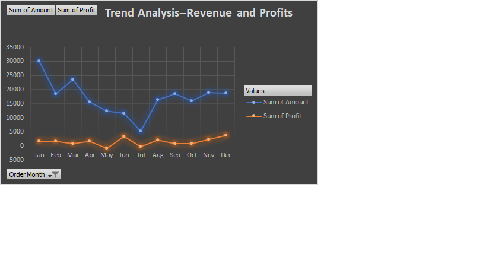
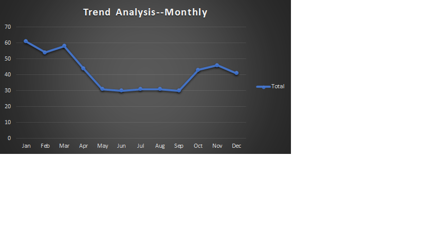
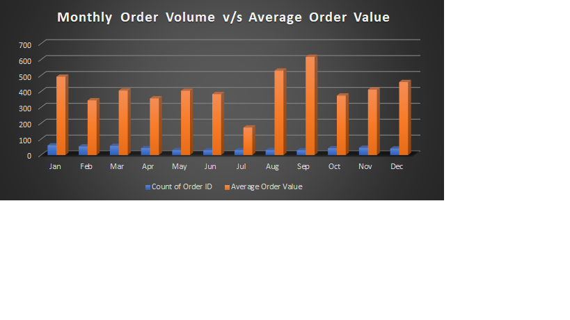
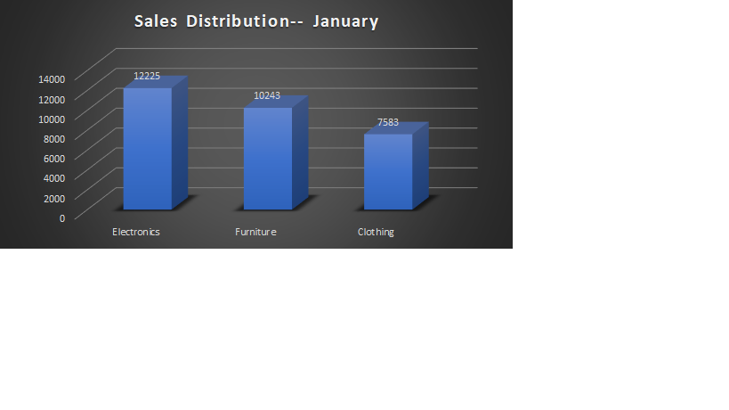
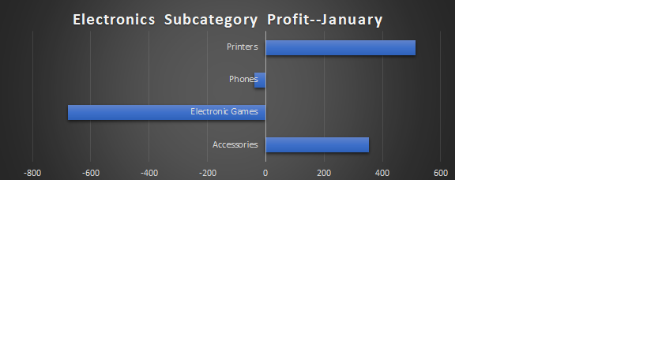

# Executive Summary
This project analyzes a multi-category retail sales dataset to diagnose the disconnect between revenue growth and profitability. While peak revenue months are driven by higher order volumes, profit margins remain relatively stable and do not scale proportionally with sales. A deeper category- level analysis reveals that although Electronics contributes the highest revenue, it operates on significantly thinner margins, with certain subcategories generating negative profit. The findings highlight the importance of balancing volume- driven growth with margin optimization.
## Revenue & Profit Trend
## Key Insights:

- Revenue peaks in January, primarily driven by higher order volume.
- Profit doesn't follow revenue trend but margins remain relatively stable.
- No evidence of huge margin expansion during demand spikes.
- Growth appears volume- led rather than pricing led.
  
## Order Volume Trend
## Key Insights:

- Order count peaks in January, confirming volume- driven revenue growth.
- Volume fluctuations significantly impact monthly revenue performance.
- High- volume months do not necessarily translate into improved profit margins.
- Business Performance appears sensitive to transaction count rather than basket expansion.

## Monthly Order Count vs Average Order Value
## Key Insights:

- January records the highest order count, aligning with peak revenue.
- September shows the highest average order value (AOV), indicating higher per-transaction spending.
- Despite higher AOV in September, total revenue does not surpass January due to lower transaction volume.
- Margin remain consistent (5-6%) across both volume- driven and value- driven months.

## January Sales Distribution by Category
## Key Insights:

- Electronics contributes the highest share of revenue in the peak month.
- Revenue concentration is skewed toward one dominant category.
- High revenue does not necessarily imply high profitability.
- Category mix plays a critical role in overall margin performance.

## Electronics Subcategory Profit Analysis-- January
## Key Insights:

- Despite leading in revenue, Electronics operates on thin Margins (1%).
- Subcategories such as Phones and Electronic games generate negative profit.
- Revenue concentration within low- margin or loss- making products compresses overall profitability.
- Product mix optimization is essential to improve margin performance.

## Business Recommendations:

- Reassess pricing and cost structure within the Electronics Category.
- Review loss- making subcategories (Phones, Electronics games) for discontinuation or cost optimization.
- Balance volume- driven growth with higher- margin product promotion.
- Monitor product mix impact during peak sales month.
## Data Scope Note

- The original dataset contained 1500 unique order IDs.
- Order Date information was available for approximately 500 entries.
- Monthly trend analysis (Revenue, Profit, Volume, AOV) is based on the orders with available date data.
- Category and subcategory profitability analysis is based on available dataset accordingly.
   

